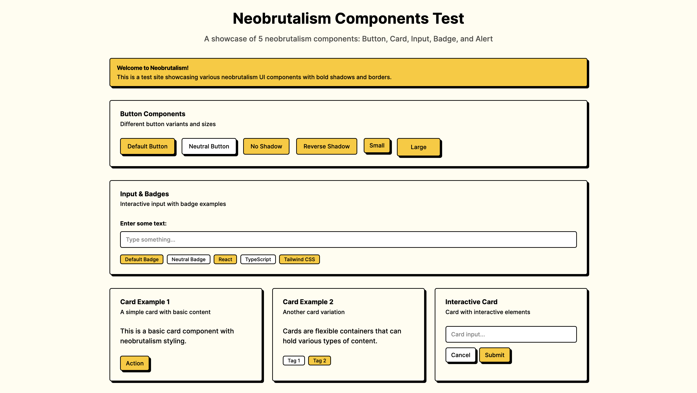

# Neobrutalism Components MCP Server

[](https://badge.fury.io/js/neobrutalism-mcp-server)
[](https://opensource.org/licenses/MIT)

> **🚀 The fastest way to integrate neobrutalism components into your AI workflow**

A Model Context Protocol (MCP) server that provides AI assistants with comprehensive access to [neobrutalism components](https://www.neobrutalism.dev/) - a collection of neobrutalism-styled React components that work with Next.js, Vite, and other React frameworks.

## ✨ Key Features

- **🎯 Neobrutalism Design** - Bold, stark, and brutalist-inspired UI components
- **📦 Component Source Code** - Latest TypeScript source code from the registry
- **🎨 Component Demos** - Example implementations and usage patterns  
- **⭐ Stars Components** - 40 unique star/decoration components (s1-s40)
- **📋 Metadata Access** - Dependencies, descriptions, and configuration details
- **🔍 Directory Browsing** - Explore repository structures
- **⚡ Local Components** - All components included locally, no external dependencies

## 🚀 Quick Start

### For Claude Code
```bash
claude mcp add neobrutalism -- npx -y neobrutalism-mcp-server
```

### For Cursor and Other AI Tools
```bash
# Simple usage!
npx neobrutalism-mcp-server
```

**🎯 All components included locally!**

## 🖼️ What You Can Build



*This entire React interface was generated with Claude Code using this MCP server in just one prompt!*

## 🎨 Component Categories

This server gives you access to cool neobrutalism components organized in different groups:

| Category | Description | Examples |
|----------|-------------|----------|
| **UI Components** | Core neobrutalism-styled React components | `button`, `card`, `dialog`, `alert` |
| **Form Components** | Input and form React components | `input`, `label`, `checkbox`, `textarea` |
| **Layout Components** | Structure and navigation components | `sheet`, `sidebar`, `navigation-menu` |
| **Star Components** | Decorative React elements | `s1`, `s2`, `s3`, ... `s40` |

## 🛠️ Setup

### For Claude Code Users
```bash
claude mcp add neobrutalism -- npx -y neobrutalism-mcp-server
```

### For Other AI Tools
First run the server:
```bash
npx neobrutalism-mcp-server
```

Then add this to your AI tool's config:
```json
{
  "mcpServers": {
    "neobrutalism": {
      "command": "npx",
      "args": ["neobrutalism-mcp-server"]
    }
  }
}
```

## 🎯 What You Can Do

- **Build Cool React UIs** - Let AI help you make React websites with neobrutalism style (not HTML pages)
- **Find Components** - See what React components are available and how to use them
- **Make Prototypes Fast** - Get working React component code quickly
- **Create Design Systems** - Build consistent brutalist-style React designs
- **Generate Code** - Get React component code with all the right dependencies

## 📦 Available Tools

This server gives AI tools these helpful functions:

- `list_components` - Get all available neobrutalism components
- `get_component` - Get source code for a specific component
- `get_component_demo` - Get demo/example usage for a component
- `get_component_metadata` - Get metadata (dependencies, type, etc.)
- `get_directory_structure` - Browse the repository structure

## 🎨 Component Examples

### React UI Components
- `button` - Neobrutalism-styled React button components
- `card` - Container React components with bold borders
- `dialog` - Modal React dialog components with stark styling
- `input` - Form input React components

### React Star Components
- `s1` to `s40` - Decorative star and ornamental React components
- Each with unique neobrutalism styling

## 📦 Installation

```bash
# Install globally (optional)
npm install -g neobrutalism-mcp-server

# Or use npx directly (recommended)
npx neobrutalism-mcp-server

# Or install locally in a project
npm install neobrutalism-mcp-server
```

## 🔗 Repository

This server includes components from [https://www.neobrutalism.dev/](https://www.neobrutalism.dev/) and the [ekmas/neobrutalism-components](https://github.com/ekmas/neobrutalism-components) repository.

## 📄 License

MIT License - see [LICENSE](LICENSE) for details.

## 🙏 Acknowledgments

- **[ekmas](https://github.com/ekmas)** - For the amazing neobrutalism components library
- **[shadcn](https://github.com/shadcn)** - For the foundational shadcn/ui architecture
- **[Anthropic](https://anthropic.com)** - For the Model Context Protocol specification

---

**Made by [https://github.com/dennisimoo](https://github.com/dennisimoo)**

**Star ⭐ this repo if you find it helpful!**